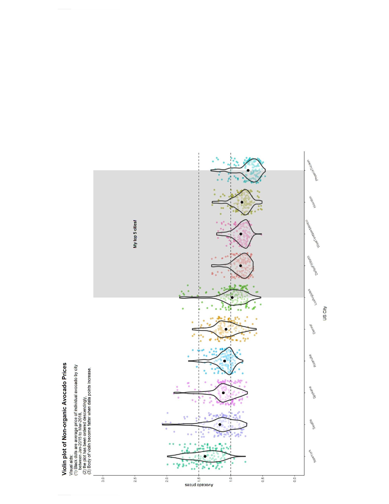
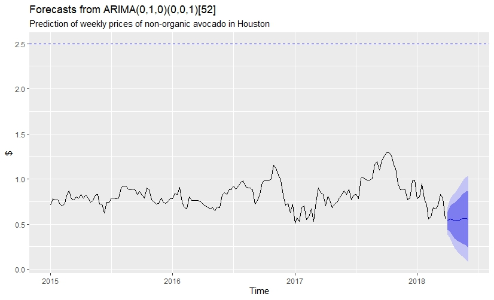
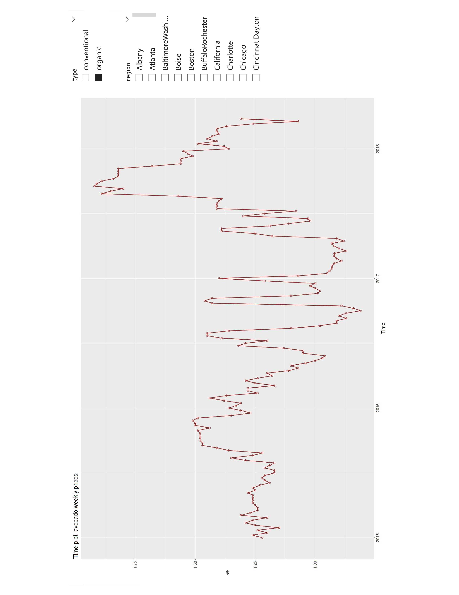

# Power BI with R
This is a showcase for extending Power BI with R based on https://learn.microsoft.com/en-us/fabric/data-science/r-avocado and fpp3 library (R Hyndman,   https://amzn.eu/d/4zaiWXZ). Relevant libraries should be installed on you machine

 

